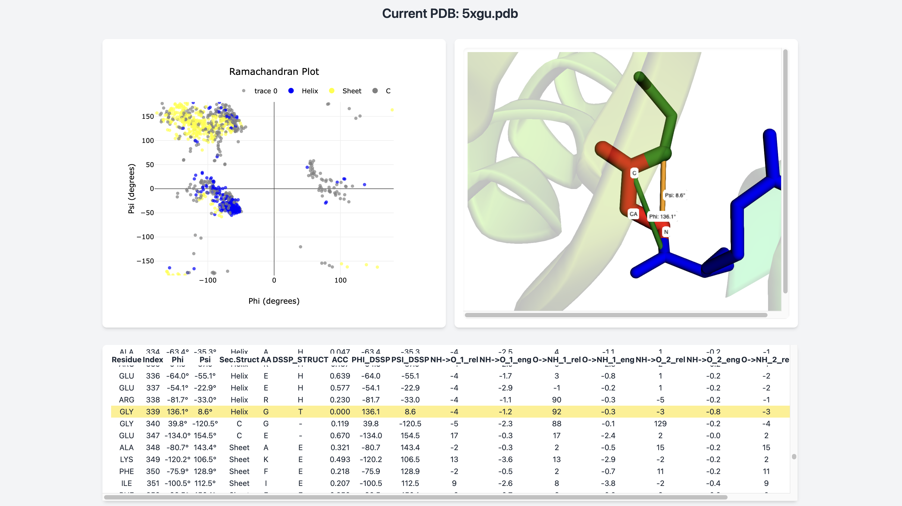

# Ramachandran Viewer
---
##### Dec 09, 2024 | S.Alireza Hashemi


<div style="text-align: justify"> 
Dash-based interactive and dynamic Ramachandran plot viewer with the ability to map the plot on a 3d representation of a PDB file.

* Denoted structures extracted from PDB file, de novo models could act tricky due to the lack of the proper annotation; this could be fixed through the DSSP implementation.
</div>



 
Installation guide:

```bash
# Create the virtual environment
python -m venv rama-env

# Activate the environment
source rama-env/bin/activate  # On macOS/Linux
rama-env\Scripts\activate     # On Windows

# Install dependencies
pip install -r requirements.txt

# Deactivate when done
deactivate

